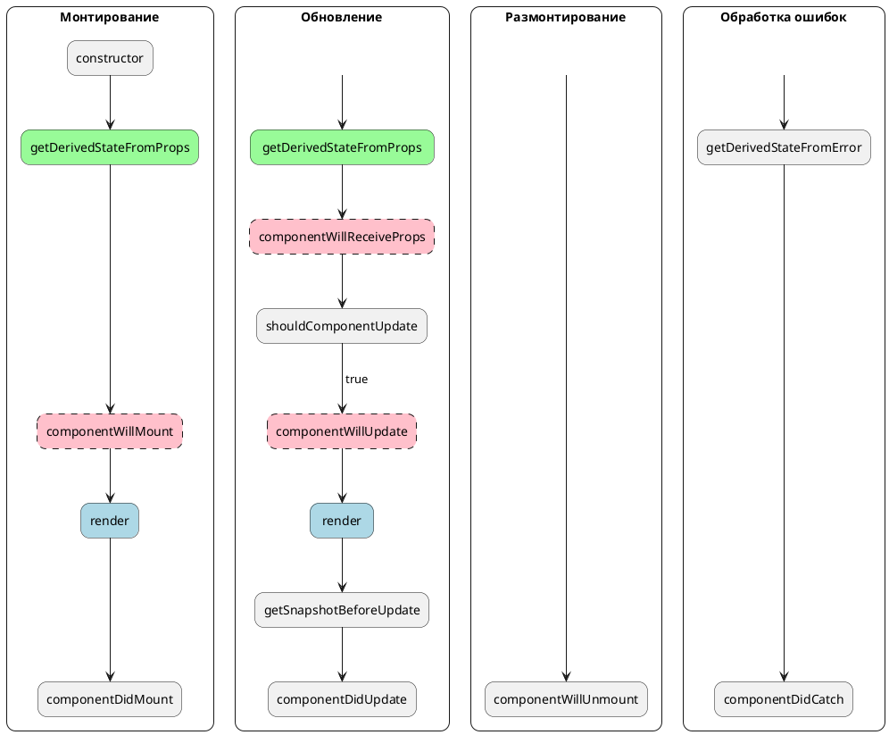

# React-Lifecycle-Diagram

```plantuml
@startuml
skinparam rectangle {
RoundCorner 20
shadowing false
}

rectangle Монтирование {

rectangle constructor
rectangle getDerivedStateFromProps #palegreen
rectangle componentWillMount #pink;line.dashed
rectangle render #lightblue
rectangle componentDidMount

constructor --> getDerivedStateFromProps
getDerivedStateFromProps ----> componentWillMount
componentWillMount --> render
render ---> componentDidMount
}

rectangle Обновление {

rectangle "empty " as e #transparent;line:transparent;text:transparent
rectangle " getDerivedStateFromProps " as gdsfp #palegreen
rectangle componentWillReceiveProps #pink;line.dashed
rectangle shouldComponentUpdate
rectangle componentWillUpdate #pink;line.dashed
rectangle " render " as r #lightblue
rectangle getSnapshotBeforeUpdate
rectangle componentDidUpdate

e --> gdsfp
gdsfp --> componentWillReceiveProps
componentWillReceiveProps --> shouldComponentUpdate
shouldComponentUpdate --> componentWillUpdate : " true"
componentWillUpdate --> r
r --> getSnapshotBeforeUpdate
getSnapshotBeforeUpdate --> componentDidUpdate
}

rectangle Размонтирование {

rectangle empty #transparent;line:transparent;text:transparent
rectangle componentWillUnmount

empty --------> componentWillUnmount
}

rectangle "Обработка ошибок" {

rectangle "empty  " as em #transparent;line:transparent;text:transparent

rectangle getDerivedStateFromError
rectangle componentDidCatch

em --> getDerivedStateFromError
getDerivedStateFromError -------> componentDidCatch
}
@enduml
```

