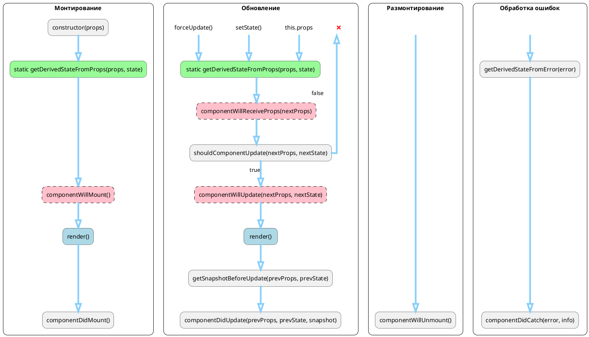

# React-Lifecycle-Diagram

```plantuml
@startuml
skinparam rectangle {
RoundCorner 20
shadowing false
}

skinparam linetype polyline
skinparam linetype ortho
skinparam arrowThickness 4
skinparam ArrowColor LightSkyBlue

rectangle Монтирование {

rectangle "constructor(props)" as con
rectangle "static getDerivedStateFromProps(props, state)" as gdsfp1 #palegreen
rectangle "componentWillMount()" as cwm #pink;line.dashed
rectangle "render()" as ren #lightblue
rectangle "componentDidMount()" as cdm

con --|> gdsfp1
gdsfp1 ----|> cwm
cwm --|> ren
ren ---|> cdm
}

rectangle Обновление {

rectangle "this.props" as props #transparent;line:transparent
rectangle "setState()" as state #transparent;line:transparent
rectangle "forceUpdate()" as fu #transparent;line:transparent
rectangle " static getDerivedStateFromProps(props, state) " as gdsfp #palegreen
rectangle "componentWillReceiveProps(nextProps)" as cwrp #pink;line.dashed
rectangle "shouldComponentUpdate(nextProps, nextState)" as scu
rectangle "❌    " as cross #transparent;line:transparent;text:red
rectangle "componentWillUpdate(nextProps, nextState)" as cwu #pink;line.dashed
rectangle " render() " as r #lightblue
rectangle "getSnapshotBeforeUpdate(prevProps, prevState)" as gsbu
rectangle "componentDidUpdate(prevProps, prevState, snapshot)" as cdu

props -D-|> gdsfp
state -D-|> gdsfp
fu -D-|> gdsfp
gdsfp --|> cwrp
cwrp --|> scu
scu -U---|> cross : "false         "
scu --|> cwu : " true"
cwu --|> r
r --|> gsbu
gsbu --|> cdu
}

rectangle Размонтирование {

rectangle empty #transparent;line:transparent;text:transparent
rectangle "componentWillUnmount()" as cwum

empty --------|> cwum
}

rectangle "Обработка ошибок" {

rectangle "empty  " as em #transparent;line:transparent;text:transparent

rectangle "getDerivedStateFromError(error)" as gdsfe
rectangle "componentDidCatch(error, info)" as cdc

em --|> gdsfe
gdsfe -------|> cdc
}

@enduml
```

