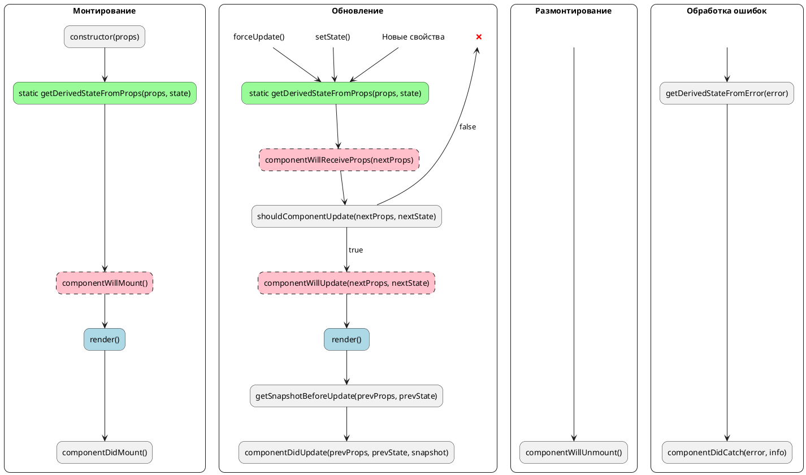

# React-Lifecycle-Diagram

```plantuml
@startuml
skinparam rectangle {
RoundCorner 20
shadowing false
}

rectangle Монтирование {

rectangle "constructor(props)" as con
rectangle "static getDerivedStateFromProps(props, state)" as gdsfp1 #palegreen
rectangle "componentWillMount()" as cwm #pink;line.dashed
rectangle "render()" as ren #lightblue
rectangle "componentDidMount()" as cdm

con --> gdsfp1
gdsfp1 ----> cwm
cwm --> ren
ren ---> cdm
}

rectangle Обновление {

rectangle "Новые свойства" as props #transparent;line:transparent
rectangle "setState()" as state #transparent;line:transparent
rectangle "forceUpdate()" as fu #transparent;line:transparent
rectangle " static getDerivedStateFromProps(props, state) " as gdsfp #palegreen
rectangle "componentWillReceiveProps(nextProps)" as cwrp #pink;line.dashed
rectangle "shouldComponentUpdate(nextProps, nextState)" as scu
rectangle "❌" as cross #transparent;line:transparent;text:red
rectangle "componentWillUpdate(nextProps, nextState)" as cwu #pink;line.dashed
rectangle " render() " as r #lightblue
rectangle "getSnapshotBeforeUpdate(prevProps, prevState)" as gsbu
rectangle "componentDidUpdate(prevProps, prevState, snapshot)" as cdu

props -D-> gdsfp
state -D-> gdsfp
fu -D-> gdsfp
gdsfp --> cwrp
cwrp --> scu
scu -U---> cross : " false"
scu --> cwu : " true"
cwu --> r
r --> gsbu
gsbu --> cdu
}

rectangle Размонтирование {

rectangle empty #transparent;line:transparent;text:transparent
rectangle "componentWillUnmount()" as cwum

empty --------> cwum
}

rectangle "Обработка ошибок" {

rectangle "empty  " as em #transparent;line:transparent;text:transparent

rectangle "getDerivedStateFromError(error)" as gdsfe
rectangle "componentDidCatch(error, info)" as cdc

em --> gdsfe
gdsfe -------> cdc
}
@enduml
```

