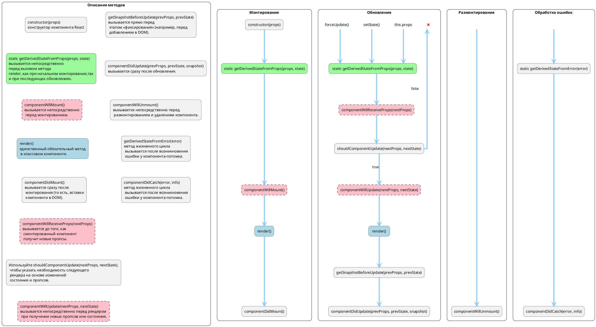

# React-Lifecycle-Diagram



```
rectangle "Описание методов" {

rectangle "constructor(props)\nконструктор компонента React" as conCom
rectangle "static getDerivedStateFromProps(props, state)\nвызывается непосредственно\nперед вызовом метода\nrender, как при начальном монтировании,так\nи при последующих обновлениях." as gdsfpCom #palegreen
rectangle "componentWillMount()\nвызывается непосредственно\n перед монтированием." as cwmCom #pink;line.dashed
rectangle "render()\nединственный обязательный метод\n в классовом компоненте." as renCom #lightblue
rectangle "componentDidMount()\nвызывается сразу после\n монтирования (то есть, вставки\n компонента в DOM)." as cdmCom

rectangle "componentWillReceiveProps(nextProps)\nвызывается до того, как\n смонтированный компонент\n получит новые пропсы." as cwrpCom #pink;line.dashed
rectangle "Используйте shouldComponentUpdate(nextProps, nextState),\n чтобы указать необходимость следующего\n рендера на основе изменений\n состояния и пропсов." as scuCom
rectangle "componentWillUpdate(nextProps, nextState)\nвызывается непосредственно перед рендером\n при получении новых пропсов или состояния." as cwuCom #pink;line.dashed
rectangle "getSnapshotBeforeUpdate(prevProps, prevState)\nвызывается прямо перед\n этапом «фиксирования» (например, перед\n добавлением в DOM)." as gsbuCom
rectangle "componentDidUpdate(prevProps, prevState, snapshot)\nвызывается сразу после обновления." as cduCom

rectangle "componentWillUnmount()\nвызывается непосредственно перед\n размонтированием и удалением компонента." as cwumCom

rectangle "getDerivedStateFromError(error)\nметод жизненного цикла\n вызывается после возникновения\n ошибки у компонента-потомка." as gdsfeCom
rectangle "componentDidCatch(error, info)\nметод жизненного цикла\n вызывается после возникновения\n ошибки у компонента-потомка." as cdcCom

conCom -[hidden]-> gdsfpCom
gdsfpCom -[hidden]-> cwmCom
cwmCom -[hidden]-> renCom
renCom -[hidden]-> cdmCom
cdmCom -[hidden]-> cwrpCom
cwrpCom -[hidden]-> scuCom
scuCom -[hidden]-> cwuCom
conCom -[hidden]> gsbuCom
gsbuCom -[hidden]-> cduCom
cduCom -[hidden]-> cwumCom
cwumCom -[hidden]-> gdsfeCom
gdsfeCom -[hidden]-> cdcCom

}
```


