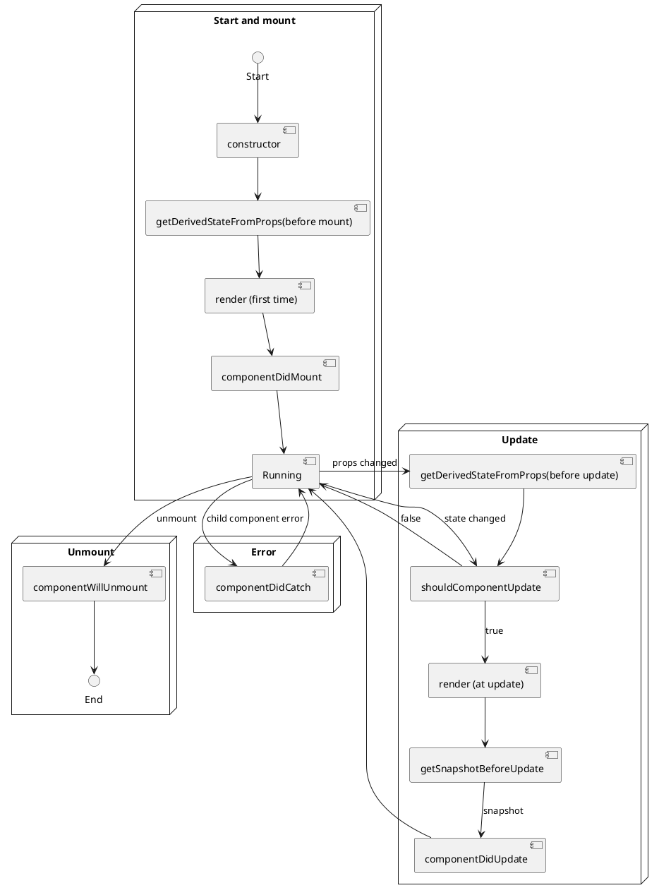

# React-Lifecycle-Diagram

```plantuml
@startuml
node "Start and mount" {
Start --> [constructor]
[constructor] --> [getDerivedStateFromProps(before mount)]
[getDerivedStateFromProps(before mount)] --> [render (first time)]
[render (first time)] --> [componentDidMount]
[componentDidMount] --> [Running]
}

node "Update" {
[Running] --> [getDerivedStateFromProps(before update)] : props changed
[Running] --> [shouldComponentUpdate] : state changed
[getDerivedStateFromProps(before update)] --> [shouldComponentUpdate]
[shouldComponentUpdate] --> [Running] : false
[shouldComponentUpdate] --> [render (at update)] : true
[render (at update)] --> [getSnapshotBeforeUpdate]
[getSnapshotBeforeUpdate] --> [componentDidUpdate] : snapshot
[componentDidUpdate] --> [Running]
}

node "Unmount" {
[Running] --> [componentWillUnmount] : unmount
[componentWillUnmount] --> End
}

node "Error" {
[Running] --> [componentDidCatch] : child component error
[componentDidCatch] --> [Running]
}
@enduml
```

