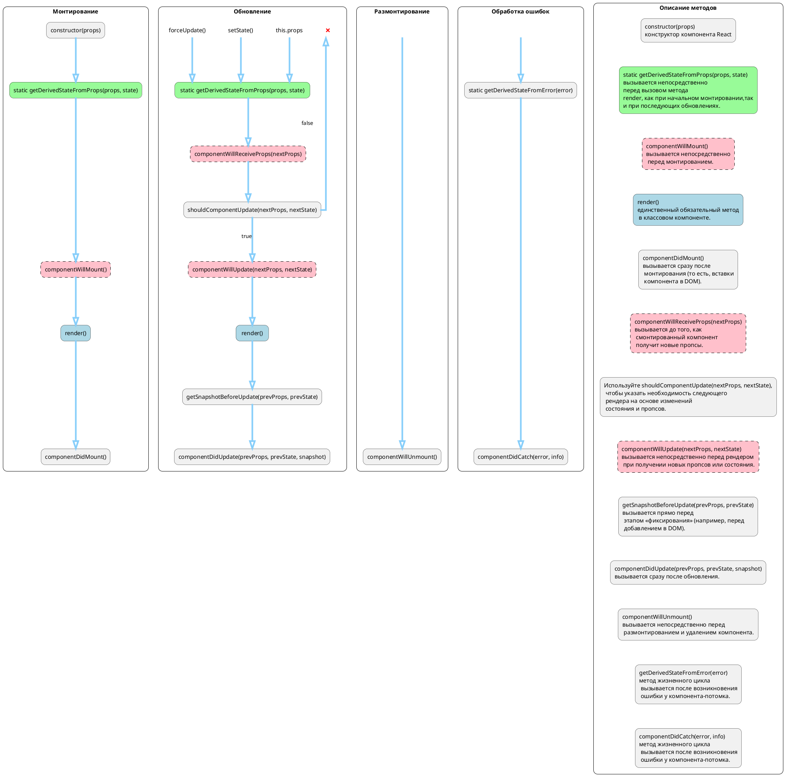

# React-Lifecycle-Diagram

![test](http://www.plantuml.com/plantuml/png/rLRDRjj64BxpAHRAnG4aeIrwIe0WZTsU6hHm6lJGzC28QuamjIIMP5oZ3U2VkcvXjxxsq1QzzwAwKIF_0tc2vIlqIVeDHvHNB6b9pga2H2vtTcQ_-MPsTXx6YQkJj1yuyRgl8bUxVQ5b9t5LDv3YQsSrJ9Mt76ebjNZl7IVkkLwuuQkkM7E3M3el7Kily9LCDYCfeZ3Of8ygMQYJNcW9NAt3ZSzwVcTToJWMxrkY3qYq70QX5X_xtLxoP7tpKP1Anxa6Q7unb-OYsp6ZR0kZOpCm5sPaXa1khMfqGXKdEkqaeLwAT1Z5Tnl2ZGMcxLMW8l4xeYkJ5Qdz5z9xWWdvaGxxdv8EQpP5JBDieEl5Qz6xuaxa1hAhfLJJc_QZK4cLVEu7mMFmc2oDjzteGyLNw_U9bRRdnZtfsPfQAa_gyMfyY3i1-VySpbTkiE9xK_QzlkF0Dz5gVVDWZD7X5wPeaY0u-FCAdUDMWaMa_NAAuz_Cds2Ls3qpmqf-avuVjtDwSW3vIDn9jAjYX188Sq_lMHDJlCiaPvhXCx_pQw-5kYEVHjwrWRLqVcsnKD35TTJd2Vggx4YOP4DAVfNaeo89T7Hp5iIzC0syvS8WkyXc61E6JDoOjqvgg__pww70ZpVJOJmZ8FSJMBkdfLVhpIm0S2czsIDH93QZqZLvtKK-A3U2_yaZYV0MqOsqV37UcORMpjtuULftCcvGHbZ7-nG79tKSJjxMokJiE9oGzWmopFxCdtoMAAmEFVYJOeA_Q3tbmyM1k2SQUVaKnQ_1YzX0IdA1SYKRi3IUrexcGUugFVWJa4kdzNVKmDVcV9wwAFjHiZb7MjWJzUcX-bCrBaKHuWrQunzxLwek3Iel03b0aRa4u5Cp41Xy3xIOCAUDKgbXavn0ihye-FdA_OTQuwAGzBokyxMbTzbDEZrUtHI-MWkBPEeG0HmcDf0_XSK6blo7Z2l4R7iIBmHo25OkpIiAOsFclVPCWK4A_NQsasrbk-QKjBCjGTCmTaL2gkAO7eXLwNQIuYf4fRdrROXjZxC3ynf_v1f11e0ZGLlHblZOmkWLeS82R4yN2fIkp90bWlN9IS9f-prufhXkDE44Z9yASmMb4LaVPFkOESiECMQrohmVDJ45JUmuAhGPbpdBSUrcFsK_G6aFkLU-xRAZRAzzNVX1q_mN_cs94HOpTMVPdBUBTWAOvkie00SceNrXxmXm9xdZsH52C81WI9oom0e5uJf64C3C0FhRHRIgacl8uB0nmCtVmDJmbVCqmFIk5JV0gUO62ak4M42Vpi5X4xXf1F4ni8wWMNaUuDtA9u_lZddrY5TdqTkznWCwm2AdyIzpMMGoSC2L2X-O-WgGqCW_pv2o-z3O4PoiM3w4X2pWkPqTj2TTnipaC3y311iz98hD2SLFBD1_DCcHVMXH3Xq8c81xd4hP8ISxIVRmfEI3mnmNKJg0GoA7R6sHjrWxfB2J0JoWmxwIfwFyZgD5t96Uv5IoNJoFE0smpYA5TDj5gmI_5krqRb_fxEDi-qRH1N2kI7PWsQdH9BZPNiaFU0RcHXK-5u5Fw-E-U9zLxpTGOUVpAHyf5Z_IWS8KbOStVsJV0kyfm9REwPipiKJHPGPW1XQQqvR059NaGL6GkVJPHvNxFxZxLYtWGgMdyfeeoaOEPNQVzBQPnEUajjbZbaPq6767sjnLrhv9slJBw6SqI71ZSa48ytT-CYyOBXSxaNrdHdnf07AbppQnk5780gammGMzK2uQGuZ8iKf7MlI90GGGir_SVy6n-Nku_uLRQ23pQ77t9bfVz7pFa-hBreD9h-Bme2Jbdi71gopX2zkXLrd7Onslh5FSCWwzIxAYrFAhf9MoKbaoESxyBgDWBQ_A7WF4kooRn9y7PKscaNhnXr9vQJ_u5m00)
