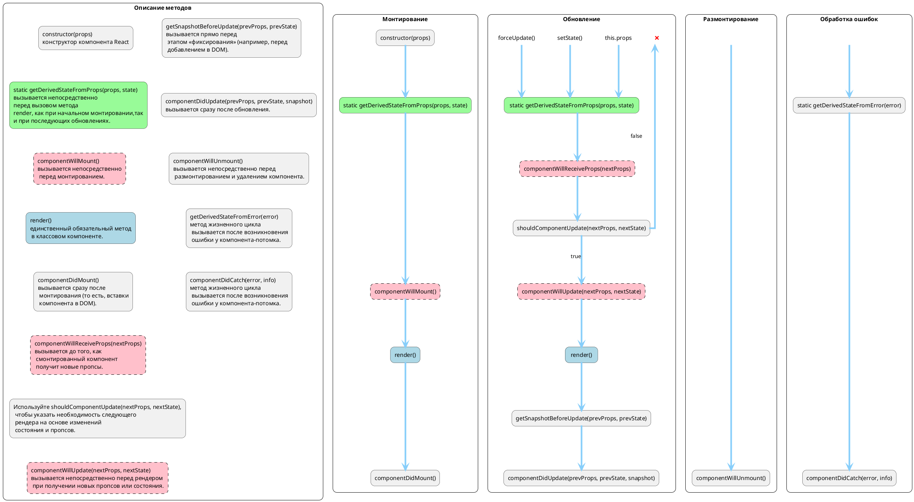
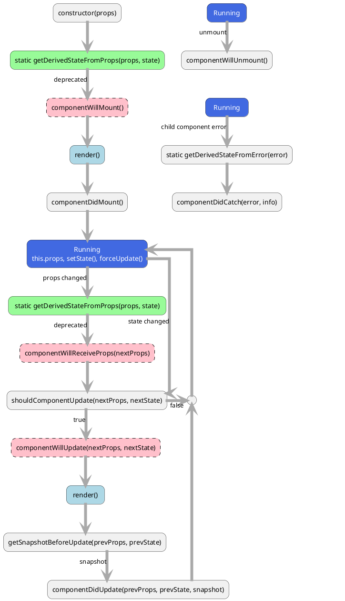

# React-Lifecycle-Diagram

Первый вариант:

```plantuml
@startuml
skinparam rectangle {
RoundCorner 20
shadowing false
}

skinparam linetype polyline
skinparam linetype ortho
skinparam arrowThickness 4
skinparam ArrowColor LightSkyBlue

rectangle Монтирование {

rectangle "constructor(props)" as con
rectangle "static getDerivedStateFromProps(props, state)" as gdsfp1 #palegreen
rectangle "componentWillMount()" as cwm #pink;line.dashed
rectangle "render()" as ren #lightblue
rectangle "componentDidMount()" as cdm

con --> gdsfp1
gdsfp1 ----> cwm
cwm --> ren
ren ---> cdm
}

rectangle Обновление {

rectangle "this.props" as props #transparent;line:transparent
rectangle "setState()" as state #transparent;line:transparent
rectangle "forceUpdate()" as fu #transparent;line:transparent
rectangle " static getDerivedStateFromProps(props, state) " as gdsfp #palegreen
rectangle "componentWillReceiveProps(nextProps)" as cwrp #pink;line.dashed
rectangle "shouldComponentUpdate(nextProps, nextState)" as scu
rectangle "❌    " as cross #transparent;line:transparent;text:red
rectangle "componentWillUpdate(nextProps, nextState)" as cwu #pink;line.dashed
rectangle " render() " as r #lightblue
rectangle "getSnapshotBeforeUpdate(prevProps, prevState)" as gsbu
rectangle "componentDidUpdate(prevProps, prevState, snapshot)" as cdu

props -D-> gdsfp
state -D-> gdsfp
fu -D-> gdsfp
gdsfp --> cwrp
cwrp --> scu
scu -U---> cross : "false         "
scu --> cwu : " true"
cwu --> r
r --> gsbu
gsbu --> cdu
}

rectangle Размонтирование {

rectangle empty #transparent;line:transparent;text:transparent
rectangle "componentWillUnmount()" as cwum

empty --------> cwum
}

rectangle "Обработка ошибок" {

rectangle "empty  " as em #transparent;line:transparent;text:transparent

rectangle "static getDerivedStateFromError(error)" as gdsfe
rectangle "componentDidCatch(error, info)" as cdc

em --> gdsfe
gdsfe -------> cdc
}

rectangle "Описание методов" {

rectangle "constructor(props)\nконструктор компонента React" as conCom
rectangle "static getDerivedStateFromProps(props, state)\nвызывается непосредственно\nперед вызовом метода\nrender, как при начальном монтировании,так\nи при последующих обновлениях." as gdsfpCom #palegreen
rectangle "componentWillMount()\nвызывается непосредственно\n перед монтированием." as cwmCom #pink;line.dashed
rectangle "render()\nединственный обязательный метод\n в классовом компоненте." as renCom #lightblue
rectangle "componentDidMount()\nвызывается сразу после\n монтирования (то есть, вставки\n компонента в DOM)." as cdmCom

rectangle "componentWillReceiveProps(nextProps)\nвызывается до того, как\n смонтированный компонент\n получит новые пропсы." as cwrpCom #pink;line.dashed
rectangle "Используйте shouldComponentUpdate(nextProps, nextState),\n чтобы указать необходимость следующего\n рендера на основе изменений\n состояния и пропсов." as scuCom
rectangle "componentWillUpdate(nextProps, nextState)\nвызывается непосредственно перед рендером\n при получении новых пропсов или состояния." as cwuCom #pink;line.dashed
rectangle "getSnapshotBeforeUpdate(prevProps, prevState)\nвызывается прямо перед\n этапом «фиксирования» (например, перед\n добавлением в DOM)." as gsbuCom
rectangle "componentDidUpdate(prevProps, prevState, snapshot)\nвызывается сразу после обновления." as cduCom

rectangle "componentWillUnmount()\nвызывается непосредственно перед\n размонтированием и удалением компонента." as cwumCom

rectangle "getDerivedStateFromError(error)\nметод жизненного цикла\n вызывается после возникновения\n ошибки у компонента-потомка." as gdsfeCom
rectangle "componentDidCatch(error, info)\nметод жизненного цикла\n вызывается после возникновения\n ошибки у компонента-потомка." as cdcCom

conCom -[hidden]-> gdsfpCom
gdsfpCom -[hidden]-> cwmCom
cwmCom -[hidden]-> renCom
renCom -[hidden]-> cdmCom
cdmCom -[hidden]-> cwrpCom
cwrpCom -[hidden]-> scuCom
scuCom -[hidden]-> cwuCom
conCom -[hidden]> gsbuCom
gsbuCom -[hidden]-> cduCom
cduCom -[hidden]-> cwumCom
cwumCom -[hidden]-> gdsfeCom
gdsfeCom -[hidden]-> cdcCom

}
@enduml
```

Второй вариант

```plantuml
@startuml
skinparam rectangle {
RoundCorner 20
shadowing false
}

skinparam linetype polyline
skinparam linetype ortho
skinparam arrowThickness 6
skinparam ArrowColor DarkGray
skinparam defaultTextAlignment center

rectangle "constructor(props)" as con
rectangle "static getDerivedStateFromProps(props, state)" as gdsfp1 #palegreen
rectangle "componentWillMount()" as cwm #pink;line.dashed
rectangle "render()" as ren #lightblue
rectangle "componentDidMount()" as cdm
rectangle "Running\nthis.props, setState(), forceUpdate()" as run #RoyalBlue;text:white
rectangle " Running " as run1 #RoyalBlue;text:white
rectangle "  Running  " as run2 #RoyalBlue;text:white
rectangle " static getDerivedStateFromProps(props, state) " as gdsfp #palegreen
rectangle "componentWillReceiveProps(nextProps)" as cwrp #pink;line.dashed
rectangle "shouldComponentUpdate(nextProps, nextState)" as scu
rectangle " " as space
rectangle "componentWillUpdate(nextProps, nextState)" as cwu #pink;line.dashed
rectangle " render() " as r #lightblue
rectangle "getSnapshotBeforeUpdate(prevProps, prevState)" as gsbu
rectangle "componentDidUpdate(prevProps, prevState, snapshot)" as cdu
rectangle empty #transparent;line:transparent;text:transparent
rectangle "componentWillUnmount()" as cwum
rectangle "empty  " as em #transparent;line:transparent;text:transparent
rectangle "static getDerivedStateFromError(error)" as gdsfe
rectangle "componentDidCatch(error, info)" as cdc

con --> gdsfp1
gdsfp1 --> cwm : " deprecated"
cwm --> ren
ren --> cdm
cdm --> run
run --> gdsfp : " props changed"
run --> scu : "state changed"
gdsfp --> cwrp : "deprecated"
cwrp --> scu
scu -R-> space : "false"
space -U-> run
scu --> cwu : "  true"
cwu --> r
r --> gsbu
gsbu --> cdu : snapshot
cdu -U-> space

run1 --> cwum : " unmount"
cwum --> run2 #line:transparent
run2 --> gdsfe : " child component error"
gdsfe --> cdc
@enduml
```

